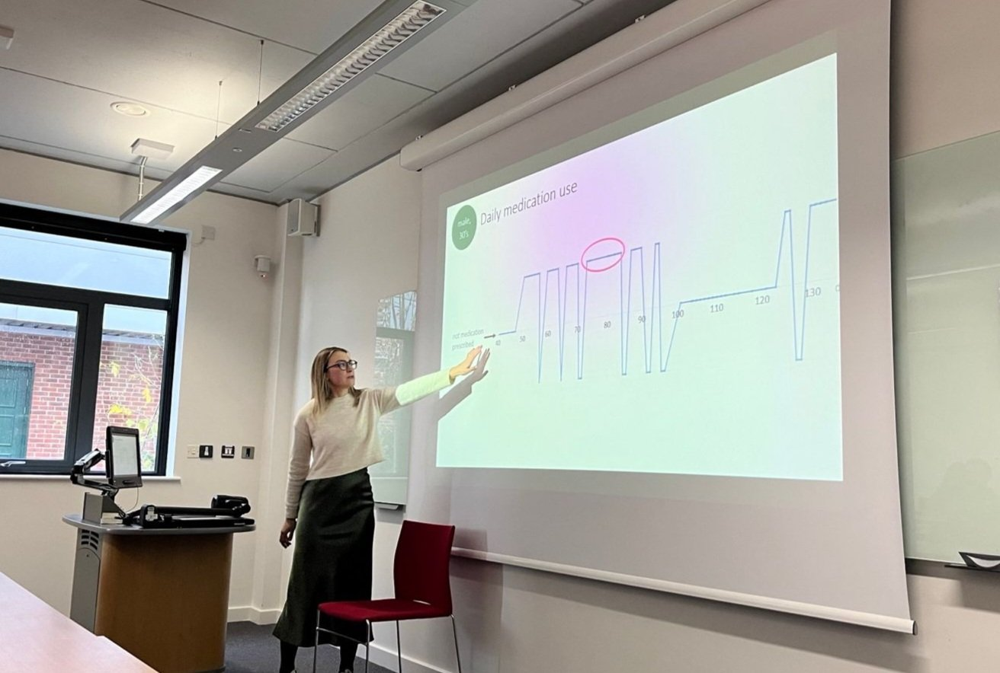
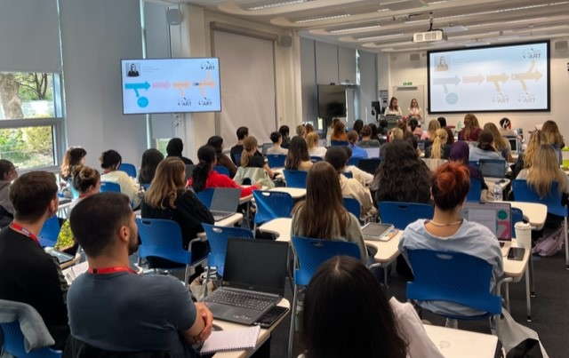
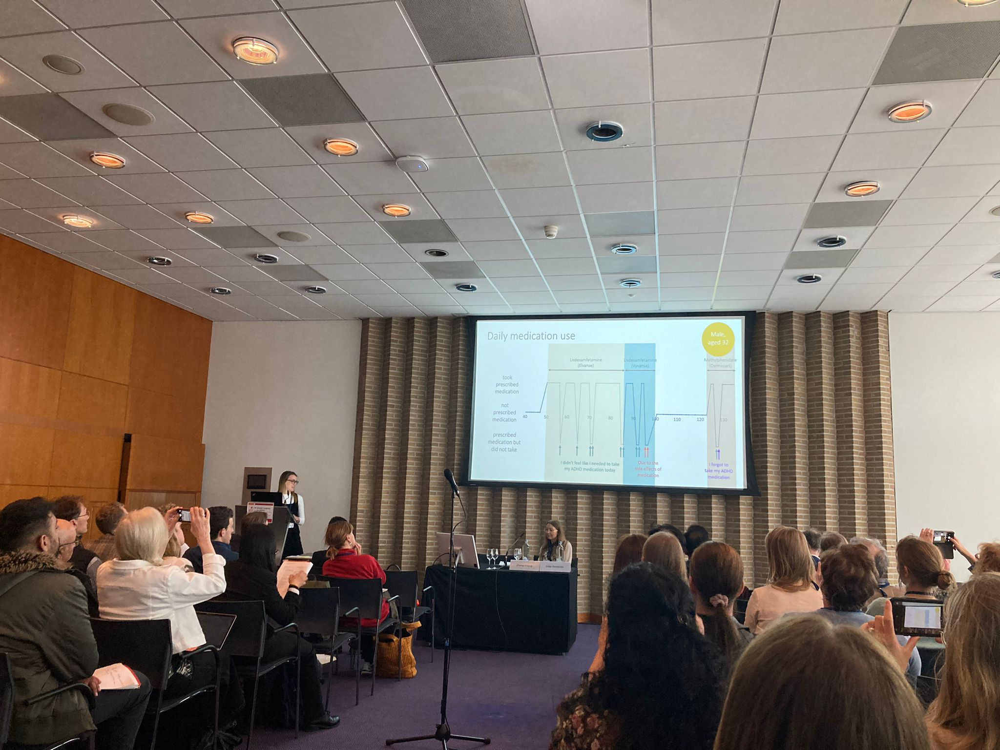

## Experience

[back to home](./index.md)

November 2023 // Giving our University of Nottingham colleagues a run down of my PhD - loved receiving feedback and suggestions to incorporate into my thesis

October 2023 // Talking to KCL MSc students about the ADHD Remote Technology programme, and my PhD!

May 2023 // First time showing the ART-CARMA medication response data to those outside of the TIMESPAN consortium. Loved showcasing how much data over the 12 months each participant is in the study for. ADHD World Congress - thanks for having me!

